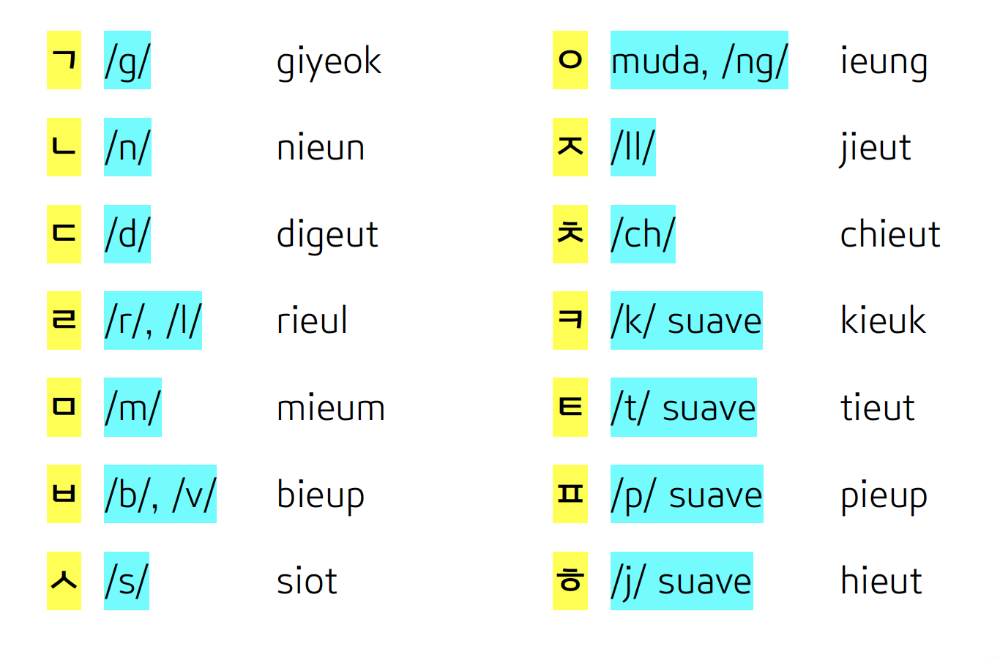
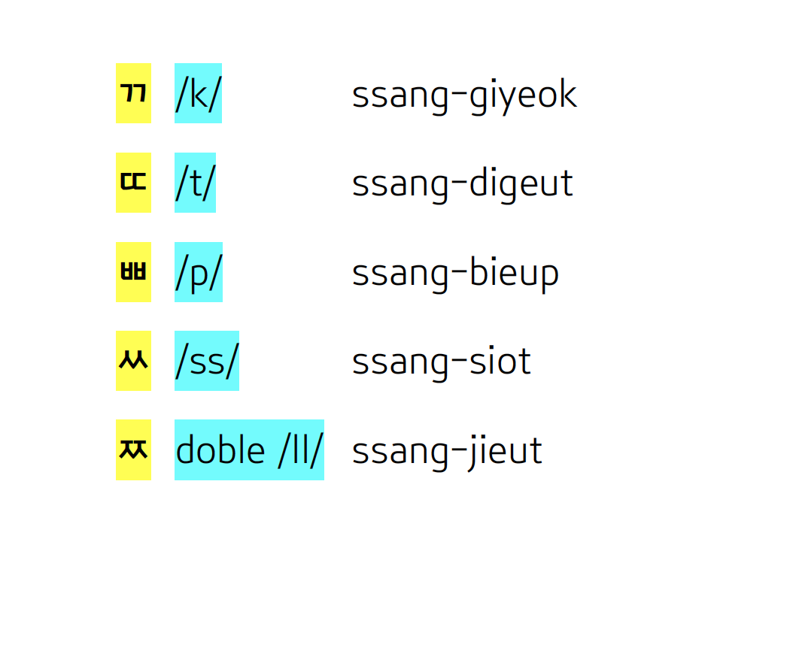

## Contenido
\tableofcontents

# **CONSONANTES DE LA ESCRITURA COREANA**

## *CONSONANTES SIMPLES*

## *CONSONANTES COMPUESTAS*

# **PRONUNCIACIÓN**
## ¿Qué sonido tienen las consonantes simples (1)?
1. **Giyeok** se pronuncia como la /g/ de "gato".
2. **Nieun** es la /n/ de "nube".
3. **Digeut** es la /d/ de "dedo".
4. **Rieul** equivale a la /r/ o la /l/. Se pronuncia como un sonido *entre la /r/ y la /l/ al principio de sílaba*, pero *cuando está al final de sílaba suena como la /l/*.
5. **Mieum** es la /m/ de "mundo".
6. **Bieup** equivale a la /b/ o la /v/ de español, como "barra" y "victoria".
7. **Siot** es la /s/ de "salida".

## ¿Qué sonido tienen las consonantes simples (2)?
8. **Ieung** es una consonante muda, como la /h/ española. No tiene nungún valor fonético, pero debemos ponerla cuando la sílaba empiece en una vocal. Al final de sílaba, esta letra suena como /ng/. Vas a encontrar una nota sobre esta consonante en la última sección de esta presentación.
9. **Jieut** suena como la /y/ o la /ll/ del español: de "yo" o "llave".
10. **Chieut** equivale a la /ch/ de "chiste".
11. **Kieuk** suena como la /c/ de "cho**c**olate". Es un poco más suave que la /k/ española.
12. **Tieut** suena como la /t/ de "Toledo", pero más suave.
13. **Pieup** suena como la /p/ de "poner", pero más suave.
14. **Hieut** es muy similar a la /j/ de "jugar", pero mucho más suave.

## ¿Qué sonido tienen las consonantes compuestas?
1. **Ssang-giyeok** es la /c/ española, de la palabra "codo".
2. **Ssang-digeut** es la /t/ de "Toledo".
3. **Ssang-bieup** es la /p/ de "poner".
4. **Ssang-siot** suena como /ss/. Es una /s/ muy tensa.
5. **Ssang-jieut** es la doble **jieut**. Por tanto, suena más tensa que la "ll". Se pronuncia como la /ch/ del dialecto canario.

# **NORMA BÁSICA**
## Debemos tener en cuenta...
### ¡Importante!
Tienes que saber que en coreano, cada sílaba debe tener **obligatoriamente** una consonante y una vocal. Es el requisito más básico.

Entonces, para escribir el sonido de la vocal /o/, siempre debemos poner la consonante muda coreana “ieung”, como la /h/ española en la palabra “hotel”.

- Ten en cuenta que la palabra “hotel” no es “otel”. Si dividimos esta palabra en sílabas, sería: “ho-tel”, no “o-tel”. Recordamos: en coreano, una sílaba debe tener al menos una consonante y una vocal. La **vocal inicial** de una sílaba *no puede estar sola.*
