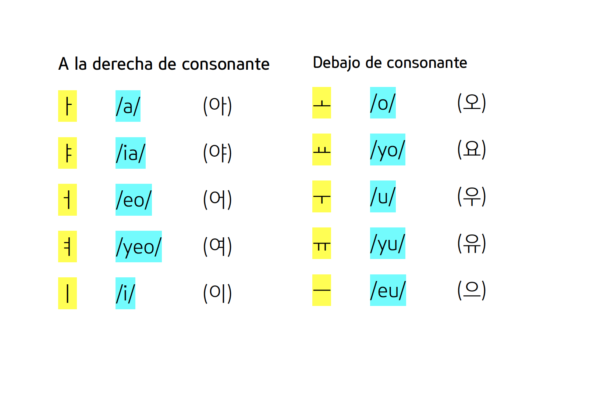
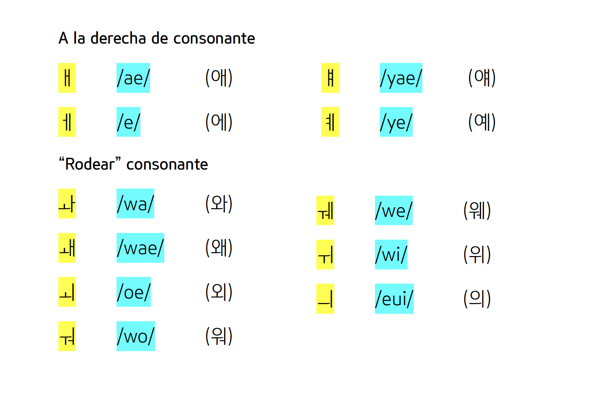

## Contenido
\tableofcontents

# **VOCALES DE LA ESCRITURA COREANA**

## *VOCALES SIMPLES*

## *VOCALES COMPUESTAS*

# **PRONUNCIACIÓN**
## ¿Qué sonido tienen las vocales simples (1)?
1. **a** es la /a/ de "vida".
2. **ya** suena como /ia/, como el nombre "Sonia".
3. **eo** es un sonido entre la /e/ y la /o/. Léelo muy rápido: /eo/.
4. **yeo** es la suma de la /i/ y la vocal coreana /eo/. Es un sonido muy similar a /io/ del nombre "Mario", pero no es exactmente lo mismo.
5. **i** es la /i/ de "lápiz"

## ¿Qué sonido tienen las vocales simples (2)?
6. **o** es la /o/ de "oro".
7. **yo** suena como /io/, del nombre "Mario", pero hay que pronunciarse muy rápido.
8. **u** es la /u/ de "uva".
9. **yu** suena como /iu/. Es muy similar al sonido de la palabra "**llu**eve".
10. **eu** no suena como “e-u”. En realidad, para un hispanohablante, es como un sonido SIN vocal. Imagínate que tienes que poner algo para completar el sonido de la /s/ final de la palabra “paraguas”, el sonido de la /d/ de “Madrid”, la /s/ de “España”, etc.

## ¿Qué sonido tienen las vocales compuestas (1)?
1. **ae** es la suma de las vocales /a/ y /i/, pero suena como una /e/ un poco más corto. No suena como /ai/.
2. **e** suena como la /e/. Se considera como una vocal compuesta, porque en coreano es la suma de las vocales /eo/ y /i/ (fíjate en la imagen anterior).
3. **yae** es la suma de las vocales coreanas /ya/ y /i/. Suena como /ie/ pronunciada muy rápida.
4. **ye** es la suma de las vocales /yeo/ e /i/. Suena como /ie/ pronunciada muy rápida.

## ¿Qué sonido tienen las vocales compuestas (2)?
5. **wa** suena como /ua/ del nombre "Juan", pronunciada muy rápida.
6. **wae** suena como /üe/ de "antigüedad", pero hay que pronunciarse muy rápida.
7. **oe** suena como /oe/ de "coerción", pero hay que pronunciarse muy rápida.
8. **wo** suena como /uo/ de "antiguo", enfatizando la /u/.
9. **we** es muy similar a la vocal coreana **/wae/**, pero la */we/ se pronuncia más larga.*
10. **wi** es la /ui/ pronunciada muy rápida.
11. **eui** es la suma de las vocales /eu/ y /i/. Es un sonido muy similar a la /ui/, pero la /u/ casi no se nota.

# **NORMA BÁSICA**
## Debemos tener en cuenta...
En la sección de las consonantes, hemos aprendido que en coreano es **obligatorio** que haya una consonante y una vocal, como mínimo, para formar una sílaba. También hemos aprendido que hay una consonante muda para cumplir esta norma.

Del mismo modo, hay una vocal que tenemos que tener en cuenta.

## Debemos tener en cuenta...
### ¡Importante!

Imaginemos que transcribimos el nombre “Marco” en coreano. Este nombre, en coreano, se divide en tres sílabas: “Ma-r-co”. Como veis, en coreano, no es un nombre de dos sílabas “Mar-co” como en español.

Ahora fíjate bien. Dijimos que necesitamos al menos una consonante y una vocal para formar una sílaba en coreano. Entonces a la letra /r/, que es una consonante, debemos poner una vocal para que pueda ser escrita correctamente en coreano. Ponemos la vocal “eu” que transcribimos como /eu/.
