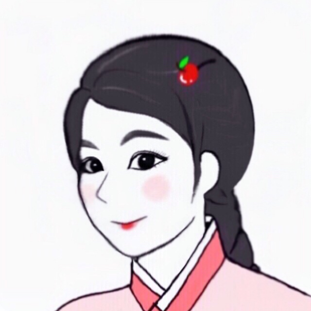

% PRESENTACIÓN DEL CURSO: ESCRITURA COREANA
% Seungmin Lee
% Curso 2019-2020

# ACERCA DE LA PROFESORA
## Perfil y datos académicos
{ width=10% }		
	
* 2018-2019: **Máster en Letras Digitales** en la Universidad Complutense de Madrid		
* 2015-2017: **Máster en Estudios Árabes e Islámicos Contemporáneos** en la Universidad Autónoma de Madrid		
* 2011-2015: **Grado en Ciencias y Lenguas de la Antigüedad** en la Universidad Autónoma de Madrid

## Datos de contacto
* iseungminial@gmail.com	
* selee@ucm.es      
* [Instagram (\@iseungmin)](https://www.instagram.com/iseungmin "Cuenta de Instagram")

# ESTRUCTURA DEL CURSO
## Datos básicos
Este curso está planteado para *alumnos coreanos de primaria en España*		

* **Objetivo didáctico**: que los alumnos sepan leer textos en coreano; y que puedan escribir en coreano.		
* **Conocimientos previos**: este curso no requiere ningún conocimiento previo.		
* **Tiempo estimado total**: 3 horas (2 horas y media para aprender las letras y 30 minutos para la práctica).		

## Esquema general
1. **Presentación html**: es el material principal del curso donde se explican las letras coreanas.
2. Presentación complementaria de **consonantes**: concentramos en la pronunciación de las consonantes coreanas.
3. Presentación complementaria de **vocales**: vemos en detalle la pronunciación de las vocales coreanas.
4. **Guión de prácticas**: contiene información sobre qué hay que hacer y cómo hay que entregar el resultado.
5. Dos **apuntes** en formato ePub: resúmenes (2 versiones) del contenido de curso.

# MÁS INFORMACIÓN
## Ante cualquier duda...
Preguntar a la profesora 	

* a través del correo electrónico (gmail o correo institucional)
* o por [Telegram](https://t.me/joinchat/AAAAAE2LzBWUpIXbE0jmPw "enlace del grupo telegram")

# ¡GRACIAS!